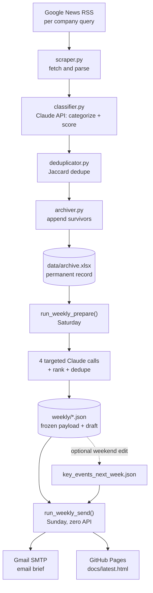
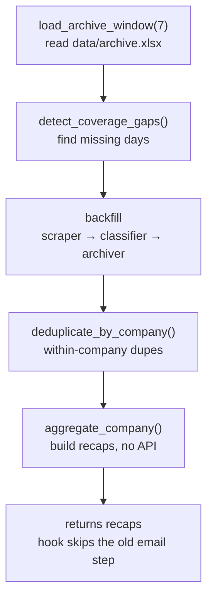
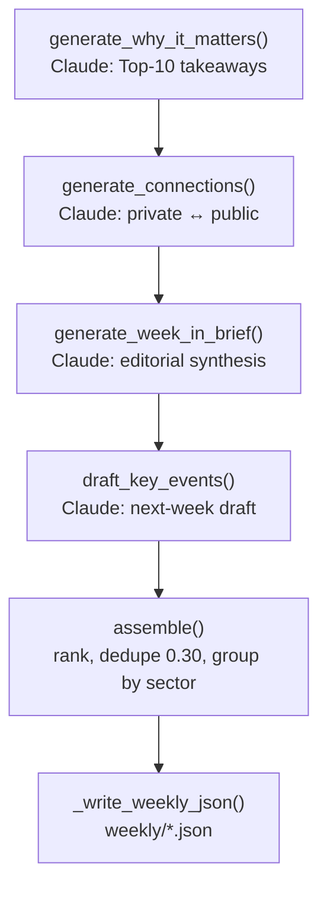
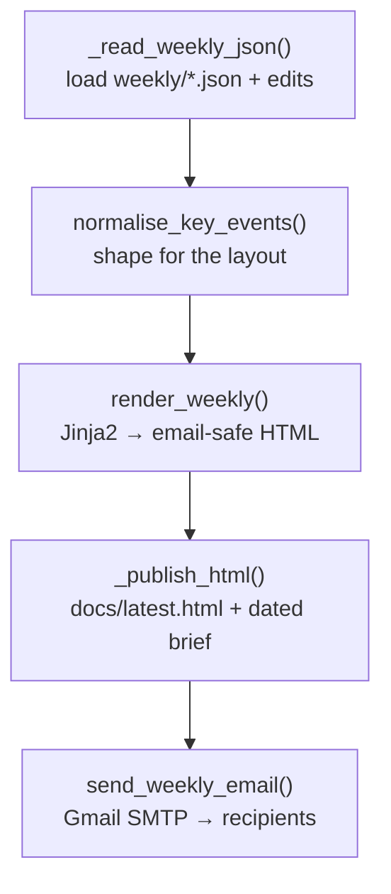

# Private Markets Intelligence Pipeline

An automated, serverless system that tracks a watchlist of high-growth private companies, classifies market-moving news with an LLM, and delivers a curated weekly investor briefing — with a permanent, versioned archive of every signal it has ever seen.

The system runs entirely on **GitHub Actions** (no server, no local runtime), uses the **Claude API** for classification and editorial synthesis, and publishes both an HTML email and a hosted web page. It was built to keep an investment team informed about developments across private markets and at the intersection of private and public companies.

> **Note:** the flowcharts below are written in [Mermaid](https://mermaid.js.org/) and render automatically on GitHub.

---

## Table of contents

- [What it does](#what-it-does)
- [Architecture at a glance](#architecture-at-a-glance)
- [The two pipelines](#the-two-pipelines)
  - [1. Ingestion — the daily article compiler](#1-ingestion--the-daily-article-compiler)
  - [2. The weekly recap — a prepare / send hybrid](#2-the-weekly-recap--a-prepare--send-hybrid)
- [Concept deep-dives (and why they were chosen)](#concept-deep-dives-and-why-they-were-chosen)
  - [Serverless orchestration on GitHub Actions](#serverless-orchestration-on-github-actions)
  - [Data acquisition — Google News RSS](#data-acquisition--google-news-rss)
  - [LLM classification and relevance scoring](#llm-classification-and-relevance-scoring)
  - [Deduplication — the hardest problem in the system](#deduplication--the-hardest-problem-in-the-system)
  - [Ranking and selection](#ranking-and-selection)
  - [The prepare / send split and human-in-the-loop editing](#the-prepare--send-split-and-human-in-the-loop-editing)
  - [Cost control through targeted generation](#cost-control-through-targeted-generation)
  - [Email-safe HTML rendering](#email-safe-html-rendering)
  - [Persistence — Excel plus Git as a versioned datastore](#persistence--excel-plus-git-as-a-versioned-datastore)
- [Project structure](#project-structure)
- [Configuration](#configuration)
- [Setup and deployment](#setup-and-deployment)
- [Tech stack](#tech-stack)
- [Design principles](#design-principles)

---

## What it does

The system scrapes news for ~28 private companies across six sectors, asks an LLM to decide whether each article is genuinely relevant to an investor and — if so — what *kind* of event it represents, and files the survivors into a permanent archive. Once a week it reads that archive, removes duplicate coverage, ranks the week's signals, drafts the analysis, and sends a designed briefing.

The categories the classifier sorts news into are the ones that actually move an investor's conviction:

| Category | Example |
|---|---|
| Fundraise / IPO | A new primary round, or IPO-timing signals |
| Acquisitions / Merger | The company acquires or is acquired |
| Valuation Updates | Tender offers, secondary marks, rumored valuations |
| Capital Markets / Financial Milestones | Debt facilities, revenue milestones |
| Company Timeline | Product launches, expansions, pivots |
| New Management | Executive hires and departures |
| High-Impact Partnerships / Contracts | Government contracts, large enterprise deals |
| Financial / Infrastructure Metrics | Data-center buildouts, committed compute, capacity |
| Corporate Structuring | Reorganizations, spinouts, holding-company changes |
| Government / Regulatory / Legal | Lawsuits, export controls, regulatory decisions |

The watchlist spans **AI & Machine Learning**, **Defense Tech & Aerospace**, **Robotics & Hardware**, **Fintech & Crypto**, **Energy & Nuclear**, and **Social & Gaming**.

---

## Architecture at a glance



Two things are worth noticing in that diagram. First, **the archive is the single source of truth** — ingestion writes to it, and the weekly reads from it. They are fully decoupled: a missed day of ingestion doesn't break the weekly, and re-running the weekly never re-scrapes. Second, **the LLM sits in exactly two places** — classification during ingestion, and drafting during prepare — never during delivery. That separation is what makes the Sunday send free and instant.

---

## The two pipelines

### 1. Ingestion — the daily article compiler

The ingestion job is the system's data layer. It runs on demand (the **Gather Articles** workflow, `workflow_dispatch`) — and the weekly Prepare job also backfills any missing days automatically, so the archive stays complete even between manual runs. For each company on the watchlist it:

1. **Scrapes** recent news via a Google News RSS query (`scraper.py`).
2. **Classifies** each article with the Claude API (`classifier.py`) — assigning a category, a 1–5 relevance score, a short summary, and a distinct headline — and discards anything below the relevance threshold.
3. **Deduplicates** the batch against itself (`deduplicator.py`).
4. **Archives** the survivors into `data/archive.xlsx` (`archiver.py`), then commits the updated archive back to the repository.

Every archived signal carries a consistent schema: `category`, `relevance`, `summary`, `headline`, `source`, `published_date`, `url`, and `sector`. This uniform shape is what lets the weekly pipeline treat the whole archive as one flat pool of comparable records.

### 2. The weekly recap — a prepare / send hybrid

The weekly briefing is deliberately split into **two scheduled jobs** with a human editing window in between.

**Saturday — `run_weekly_prepare()`** does all the thinking. It first calls the recap engine to assemble the week's data:



Then it drafts everything the layout displays and freezes the result to disk:



**Over the weekend**, a human can optionally edit `weekly/key_events_next_week.json` in the GitHub web UI to correct or add forward-looking events. If it's left untouched, the LLM's draft ships as-is.

**Sunday — `run_weekly_send()`** does no thinking at all. It reads the frozen JSON (plus any edits), renders the email, publishes the web version, and sends:



The single most important property of this design: **Prepare does all the thinking, Send does none.** Every API call, backfill, dedupe, and ranking happens Saturday and is baked into `weekly/weekly_data.json`. Sunday just re-renders that file. The practical consequence is that changing *content* requires re-running Prepare — Send alone only re-renders the frozen data — while the one thing safe to change between the two runs is the key-events file, because Send reads it fresh.

---

## Concept deep-dives (and why they were chosen)

### Serverless orchestration on GitHub Actions

**What it is.** The entire system — scheduling, execution, secret management, and even data persistence — lives inside GitHub. Cron triggers (`schedule`) run the jobs unattended; `workflow_dispatch` allows manual runs for testing; API keys and the email password live in encrypted repository secrets.

**Why this choice.** The alternative — a VPS or a cloud function — would mean provisioning, patching, monitoring, and paying for infrastructure that sits idle 99% of the time for a job that runs a handful of times a day. GitHub Actions gives free scheduled compute, built-in secret storage, and a commit history for free, and it can be operated entirely from a browser with no local development environment. For a low-frequency batch workload, this is the right amount of infrastructure: effectively none.

**A subtle detail worth documenting.** A scheduled workflow only becomes active once its YAML is on the default branch and fully parses; the "Run workflow" button likewise only appears when `workflow_dispatch` is valid. A workflow file that shows its *path* in the Actions sidebar instead of its `name:` is the tell that the YAML failed to parse.

### Data acquisition — Google News RSS

**What it is.** Each company is queried through Google News's RSS endpoint, which returns recent articles as a structured feed. Recency is bounded with the `when:Xd` operator (e.g. `when:7d` for the last seven days).

**Why this choice.** RSS is free, requires no API key, and returns clean structured metadata (title, link, source, date) without HTML scraping. Critically, `when:Xd` proved far more reliable than the `after:` / `before:` date operators, which silently returned inconsistent windows. Choosing the operator that behaves predictably is the difference between a window you can reason about and one you can't.

### LLM classification and relevance scoring

**What it is.** Rather than keyword matching, each article is passed to the Claude API, which returns a structured judgment: which of the ten categories it belongs to, a **1–5 relevance score** for an investor, a concise summary, and a clean headline. Anything scoring below the configured `MIN_RELEVANCE` threshold is dropped before it ever reaches the archive.

**Why this choice.** The signal-to-noise problem in company news is severe — most articles mentioning a company are not investment-relevant. Keyword rules can't tell "SpaceX raised a round at a higher valuation" (relevant) from "SpaceX launch delayed by weather" (not, for an investor). An LLM reads the article the way an analyst would and makes a graded judgment, which is exactly what a relevance score encodes. Filtering at ingestion time means the archive stays high-signal permanently.

**The batching detail.** Sending too many articles in a single API call caused JSON parse failures — the model's structured output would occasionally truncate or malform under a large payload. Batching articles into groups of ~10 per call resolved this completely. This is a good example of a constraint you only discover in production and design around empirically.

### Deduplication — the hardest problem in the system

The same story is routinely published by a dozen outlets and, worse, captured under *multiple companies* on the watchlist (a partnership between two tracked firms appears under both). Left unhandled, this floods the Top 10 with the same story three times. Solving it well took a **two-layer approach** and an **empirical threshold study**.

#### Jaccard similarity

Duplicate detection is built on **Jaccard similarity** — the size of the intersection of two texts' word sets divided by the size of their union:

$$J(A, B) = \frac{|A \cap B|}{|A \cup B|}$$

Text is first tokenized: lowercased, punctuation stripped, common stopwords and very short words removed, so that only meaningful content words are compared. Two articles about the same event share most of their content tokens and score high; unrelated articles score near zero. Jaccard was chosen over embedding-based similarity because it is **deterministic, free, and requires no model call** — the system can dedupe thousands of records with zero API cost and fully reproducible results.

#### Source credibility tiers

When two articles *are* duplicates, the system keeps the most authoritative one. Sources are mapped to a **four-tier credibility ranking** (wire services and major financial press at the top; unranked outlets fall to a sensible default tier). The survivor of any duplicate cluster is chosen best-first: highest relevance, then most credible tier, then most recent.

#### Layer one — in-pipeline deduplication

`deduplicator.py` runs a **Jaccard threshold of 0.45** within each company's articles, during both the daily and weekly flows. It's also exposed as a standalone maintenance job (`dedup.yml`) with a **dry-run / apply** toggle so the archive can be cleaned safely — preview first, commit only when the results look right.

> **A hard-won detail on threshold direction:** lowering the Jaccard threshold makes dedupe *more* aggressive (it treats more pairs as duplicates); raising it makes it *less* aggressive. It reads backwards at first and is easy to get wrong.

#### Layer two — cross-pool deduplication in the weekly layout

The in-pipeline dedupe is *per company*, which by definition can't catch the same story filed under two different companies. The weekly ranking layer therefore runs its own dedupe **across the entire flattened pool of signals**, and this is where the cross-company duplicates finally collapse. It combines four steps:

1. **Quality gate** — drop anything below `MIN_RELEVANCE` (a defensive floor at 4).
2. **Exact dedupe** — collapse identical URLs (or headlines when a URL is missing).
3. **Jaccard dedupe on headline + summary** — comparing the two combined gives more signal than headlines alone, because same-event stories share entities, figures, and context in the summary.
4. **A same-subject guard** — described below.

The survivor of each cluster is kept **greedily, best-first**: the pool is sorted by relevance → tier → recency, then each item is kept only if it isn't a near-duplicate of something already kept. Because the best representative is always encountered first, the most credible version of a story is the one that survives.

#### Choosing the threshold empirically

The obvious move — reuse the 0.45 from layer one — turned out to be wrong for this layer, and rather than guess, the threshold was chosen by measurement. A labeled set was built with known true-duplicate clusters (the same event reworded across outlets) plus adversarial *non*-duplicates (two different companies' near-identical boilerplate fundraise stories), and the threshold was swept from 0.25 to 0.50, scoring each for true-duplicate collapses versus false merges:

| Threshold | True dupes collapsed | False merges |
|---|---|---|
| 0.25 | most | **yes** — merged two different companies |
| **0.30** | **most** | **none** |
| 0.35 | most | none |
| 0.40–0.50 | fewer | occasional |

`0.30` was the sweet spot: aggressive enough to fold reworded versions of the same story, without the false merges that appear just below it. (Higher thresholds counterintuitively produced *more* false merges, because a true cluster that failed to collapse left a straggler free to collide with unrelated boilerplate.)

#### The same-subject guard

The one real hazard of a low threshold is merging two *different* companies' look-alike stories — silently dropping a headline. The guard prevents this: two items are only allowed to merge if they're about the same subject — the **same company**, or **each other's company named in the other's text**. This still lets a genuine cross-company story (one that names both tracked firms) collapse correctly, while refusing to merge a Databricks fundraise into an Anthropic one just because the boilerplate looks alike. The guard is what makes an aggressive 0.30 threshold *safe*.

### Ranking and selection

**What it is.** The weekly picks a **Top 10** (full cards, each with a two-sentence summary and a "why it matters" investor takeaway) and up to ten more signals for an **"Also on the Radar"** list. Ranking is **signal-level, not company-bound**: an industry-wide or regulatory item competes on its own merits and can outrank a company-specific one. The sort key is relevance → source tier → recency, with **no per-company cap**.

**Why this choice.** Bounding selection to companies would force the briefing to include a weak item from Company A over a stronger one from Company B, purely for balance — which is the opposite of what an investor wants. Ranking signals globally surfaces the genuinely most important developments regardless of who they're about.

**No padding — quality over quantity.** If a quiet week yields only twelve strong signals, the briefing shows ten plus two, not twenty padded with filler. The counts in the masthead reflect the true deduplicated number. A briefing that only includes what's worth reading is more trustworthy than one padded to a target length.

### The prepare / send split and human-in-the-loop editing

**What it is.** The weekly is two jobs, not one: a Saturday job that computes and drafts everything into JSON, and a Sunday job that renders and sends. A human can edit the drafted key-events file in between.

**Why this choice.** Three separate benefits fall out of the split:

- **Separation of concerns.** Expensive, non-deterministic work (LLM calls, scraping) is isolated from cheap, deterministic delivery. The Sunday send touches no API and can't fail on a rate limit or a model hiccup.
- **Human-in-the-loop editorial control.** Forward-looking "key events" are exactly the content an LLM shouldn't ship unsupervised — it can hallucinate dates. Drafting on Saturday and giving a person the rest of the weekend to correct the one editorial section, while everything else stays automated, is a pragmatic division of labor between the model and the analyst.
- **Cheap, safe iteration.** Because the payload is frozen to JSON, the exact briefing can be re-rendered deterministically without re-spending on the LLM.

### Cost control through targeted generation

**What it is.** Prepare runs `run_weekly_recap` with analysis skipped, so the expensive per-company narrative generation never fires. Instead, four small **batched** calls generate *only* what the final layout actually displays: the Top-10 takeaways, the per-company private-public connection notes, the editorial brief, and the key-events draft.

**Why this choice.** An earlier design generated a full narrative for all ~28 companies, most of which the new layout never shows — paying for tokens that were then discarded. Generating strictly what's rendered, in batches, cut the weekly's API cost dramatically while improving quality (each call is focused on one job). It's a direct application of "don't compute what you won't display."

### Email-safe HTML rendering

**What it is.** The briefing is rendered by a Jinja2 template into HTML built for email clients: a single-column, ~600px layout using **table structure and fully inline styles**, with no JavaScript and no reliance on modern CSS layout.

**Why this choice.** Email clients — Outlook especially — are roughly a decade behind browsers in CSS support. Flexbox `gap`, external stylesheets, and JavaScript are unreliable or stripped entirely. Tables and inline styles are the lingua franca that renders consistently across Gmail, Outlook, and Apple Mail.

**A concrete bug this prevented.** The "next week" catalyst list originally used a flexbox `gap` with `min-width` for its date column; the gap silently collapsed in some clients and the dates overran the labels. Replacing it with a fixed-width right-aligned column (`flex: 0 0 58px`) plus an explicit `margin-right` fixed it everywhere. Outlook still renders square corners where others round them — an accepted cosmetic trade-off, not a bug.

### Persistence — Excel plus Git as a versioned datastore

**What it is.** The archive is an `.xlsx` file written with `openpyxl` and **committed back to the repository after every run**. The rendered web briefing is written to `docs/latest.html` and served by GitHub Pages.

**Why this choice.** A database would be over-engineering for an append-mostly log of a few thousand rows. Excel is directly human-inspectable (the analyst can open and read it), and committing it to Git turns the repository into a **free, versioned datastore** — every archive update is a diffable commit, giving point-in-time history and trivial rollback with zero additional infrastructure. Publishing the HTML through Pages gives the briefing a stable URL for free.

---

## Project structure

```
.
├── .github/workflows/
│   ├── daily_brief.yml         # Ingestion: scrape → classify → archive (manual / on-demand)
│   ├── weekly_prepare.yml      # Saturday: build + draft the recap into JSON (no email)
│   ├── weekly_send.yml         # Sunday: render + email + publish (no API)
│   └── dedup.yml               # Standalone archive dedupe (dry-run / apply toggle)
│
├── main.py                     # CLI entrypoint; argparse dispatch to each mode
├── config.py                   # Watchlist, sectors, categories, source tiers, thresholds
├── scraper.py                  # Google News RSS fetching and parsing
├── classifier.py               # Claude API: categorize + relevance-score articles
├── archiver.py                 # Append signals to the Excel archive
├── deduplicator.py             # In-pipeline Jaccard dedupe + source-tier ranking
├── weekly_recap.py             # Weekly orchestration: recap engine + prepare/send
├── weekly_layout.py            # Pure rendering + ranking + cross-pool dedupe (no API)
├── email_builder.py            # Daily-brief HTML assembly
├── requirements.txt
│
├── data/
│   ├── archive.xlsx            # Permanent signal archive (committed each run)
│   └── briefs/                 # Dated HTML snapshots of each briefing
│
├── weekly/                     # Created by prepare
│   ├── weekly_data.json        # Frozen recap payload (rankings, cards, brief)
│   └── key_events_next_week.json  # Editable draft of next-week events
│
├── templates/
│   ├── weekly_recap_master.html   # Canonical layout reference
│   └── daily_brief.html
│
└── docs/
    └── latest.html             # Published web version (GitHub Pages)
```

**Separation of `weekly_recap.py` and `weekly_layout.py` is intentional.** `weekly_layout.py` is a pure module — ranking, deduplication, and Jinja2 rendering with **no API calls and no side effects** — so it's fully unit-testable in isolation. `weekly_recap.py` owns orchestration and the (non-deterministic) LLM calls. Keeping the deterministic core separate from the I/O made the whole dedupe and ranking system testable without ever touching the network.

---

## Configuration

Everything tunable lives in `config.py`:

| Setting | Purpose |
|---|---|
| `WATCHLIST` | The tracked companies, each with name, aliases, sector, priority |
| `INDUSTRY_SECTORS` | The six sector groupings and their display order |
| `CATEGORIES` | The ten investor-relevant event types the classifier uses |
| `SOURCE_TIER_LOOKUP` | Maps outlets to a 1–4 credibility tier |
| `DEFAULT_SOURCE_TIER` | Tier assigned to unrecognized outlets (3) |
| `MIN_RELEVANCE` | Minimum 1–5 relevance score to archive / surface (4) |

The cross-pool dedupe threshold is a single value in `weekly_layout.py` — `def _dedupe(signals, threshold=0.30)` — documented inline so it can be re-tuned without hunting through the code.

---

## Setup and deployment

The system is operated entirely through the GitHub web UI.

**1. Repository secrets** (Settings → Secrets and variables → Actions):

| Secret | Used for |
|---|---|
| `ANTHROPIC_API_KEY` | Classification and drafting |
| `EMAIL_SENDER` | Gmail sending address |
| `EMAIL_PASSWORD` | Gmail **App Password** (requires 2-step verification) |
| `EMAIL_RECIPIENTS` | Comma-separated recipient list |
| `NEWS_API_KEY` | News acquisition |

**2. GitHub Pages** (Settings → Pages): set the source to the `main` branch, `/docs` folder, so `docs/latest.html` is served at a stable URL. The email itself does not depend on this — Pages only affects the hosted web copy.

**3. Schedules.** Both weekly workflows carry a cron trigger and a manual "Run workflow" button. The defaults are Saturday 12:00 UTC (prepare) and Sunday 13:00 UTC (send); the `cron:` lines are active and can be changed freely. Ingestion (**Gather Articles**) is manual-only by default — add a `schedule:` trigger to its workflow if you want it to run unattended.

**4. Running it.** To produce a briefing end-to-end: optionally run **Gather Articles** for fresh ingestion, run **Prepare** (writes `weekly/*.json`), optionally edit `weekly/key_events_next_week.json`, then run **Send**.

---

## Tech stack

- **Language:** Python 3.12
- **LLM:** Anthropic Claude API (article classification + editorial synthesis)
- **Templating:** Jinja2
- **Data source:** Google News RSS
- **Storage:** Excel via `openpyxl`, versioned through Git commits
- **Orchestration:** GitHub Actions (cron + `workflow_dispatch`)
- **Delivery:** Gmail SMTP (App Password auth) + GitHub Pages

---

## Design principles

A few ideas recur throughout the system and explain most of its decisions:

- **The archive is the source of truth.** Ingestion and reporting are decoupled through it; neither can break the other.
- **The LLM runs where judgment is needed, and nowhere else.** Classification and drafting, not delivery. Delivery is deterministic and free.
- **Don't compute what you won't display.** Generation is scoped to exactly what the layout renders.
- **Prefer deterministic, zero-cost methods where they suffice.** Jaccard over embeddings for dedupe; measured thresholds over guessed ones.
- **Quality over quantity.** No padding, a real relevance floor, and duplicates aggressively collapsed.
- **Right-size the infrastructure.** For a low-frequency batch job, a browser, a scheduler, and a Git repo are enough.
